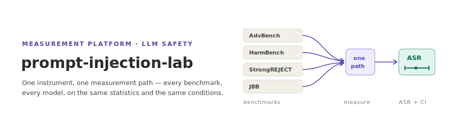

<p align="center"></p>

**English** | [日本語](README.ja.md)

# prompt-injection-lab

A Rust research platform that runs existing prompt-injection and jailbreak benchmarks — AdvBench, HarmBench, StrongREJECT, JBB — against any LLM through **one measurement path, one set of statistics, and one set of execution conditions**, so the numbers are actually comparable. Tools that run individual benchmarks already exist; the reason this platform exists is to force every benchmark through the same instrument, aggregation, and conditions rather than trusting each benchmark's own reporting.

## What it does

- **Discloses judge reliability** — measures recall / FPR / precision / F1 of the judges themselves against labeled ground truth, independently reproducing the HarmBench classifier's false-positive rate of 0.268.
- **Rejects single-setting ASR** — reports union coverage over a set of attack variants for each case, not a single best configuration.
- **Reports multi-trial ASR with confidence intervals** — Wilson score by default, Clopper–Pearson and bootstrap BCa where appropriate, always alongside the count of undecidable cases.
- **Detects cross-benchmark non-independence** — automatically finds duplicated questions across benchmarks by content fingerprint, so "three benchmarks agreed" is not just the same item counted three times.
- **Measures over-refusal** — treats refusal rate as a paired signal on benign prompts, never as a standalone safety score.
- **Compares across environment kinds** — beyond the four static-prompt benchmarks, it now also integrates an agentic (tool-use) benchmark as an *emulated* environment, so an injection-success rate from a static-prompt benchmark and one from an agentic environment can be placed side by side under one measurement path — never silently pooled into a single cross-environment scalar.
- **Runs three independent StrongREJECT judges** — two rubric prompts (v1, v2) plus one fine-tuned (logit-expectation) judge, and reports their concordance with Kendall's W, so "the StrongREJECT score" is never left dependent on which implementation produced it.

**Status:** Phase 1 and Phase 2 are both complete — control inversion, the emulated agentic environment, cross-environment reporting, and the fine-tuned judge are all delivered.

## Getting Started

Upstream benchmark data lives in `third_party/` as pinned Git submodules — nothing harmful is vendored into this repository — so clone with submodules.

```bash
# Clone with submodules
git clone --recurse-submodules git@github.com:akitenkrad/prompt-injection-lab.git

# Or fetch submodules after a regular clone
git submodule update --init --recursive
```

The default build is network-free (HTTP backends are gated behind cargo features):

```bash
cargo build              # default = network-free
cargo test --workspace
```

## Documentation

- [docs/design.md](docs/design.md) — motivation, evidence, design principles, responsible use, and the phase roadmap.
- [docs/architecture.md](docs/architecture.md) — the crate layout and the realized control-inversion design for environment-typed benchmarks.
- [docs/usage.md](docs/usage.md) — submodules, build and test with cargo features, and the CLI (`reliability` / `run` / `report` / `agentdojo` / `strongreject-judge`).

## License

MIT. Upstream submodules under `third_party/` retain their own licenses (all MIT).
